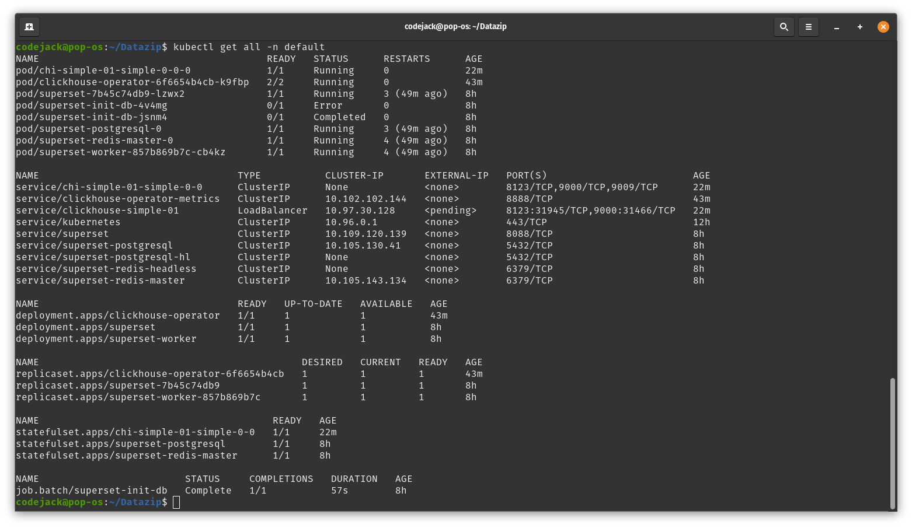
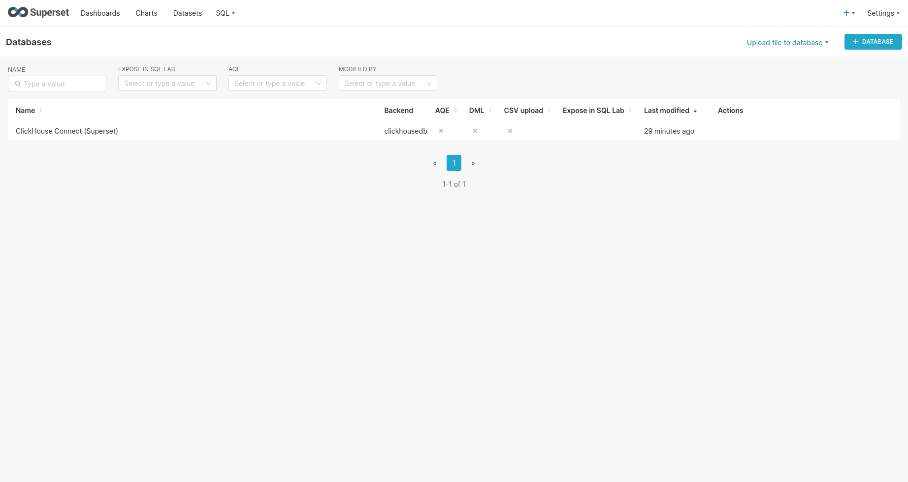

# Installation for clickouse and superset

## Requirements
### Setup
- Setup Minikube 
- Install minikube persistent volume addon
- Create superset installation
- Create a clickhouse statefulset.
    - Persistant volume of 10Gb
    - servic exposed on port 9000
### Functional
- Add clickhouse as a data source in superset inside the K8s cluster

## Steps to follow

### minkube setup commands 
| start the minikube on your local machine
```shell
minikube start
```
| check if minikube is running or not
```shell
minikube status
```
| enable store-provisioner to add pvc to the cluster

```shell
minikube addons enable storage-provisioner
```


### Clickhouse installation

| install the clickhouse[./clickhouse-operator.yaml]
```shell
kubectl apply -f clickhouse-operator.yaml -n default
```
| insttall the clickhouse-cluster[./clickhouse-cluster.yaml] using the operator
```shell
kubectl apply -f clickhouse-cluster.yaml -n default
```
| install the superset cluster[./superset.yaml]
```shell
kubectl apply -f superset.yaml -n default
```

| output of all the servieces running 
```shell
codejack@pop-os:~/Datazip$ kubectl get svc
NAME                          TYPE           CLUSTER-IP       EXTERNAL-IP   PORT(S)                         AGE
chi-simple-01-simple-0-0      ClusterIP      None             <none>        8123/TCP,9000/TCP,9009/TCP      67m
clickhouse-operator-metrics   ClusterIP      10.102.102.144   <none>        8888/TCP                        2d16h
clickhouse-simple-01          LoadBalancer   10.98.83.200     <pending>     8123:30207/TCP,9000:30365/TCP   72m
kubernetes                    ClusterIP      10.96.0.1        <none>        443/TCP                         3d4h
superset                      ClusterIP      10.103.34.38     <none>        8088/TCP                        59m
superset-postgresql           ClusterIP      10.103.134.148   <none>        5432/TCP                        59m
superset-postgresql-hl        ClusterIP      None             <none>        5432/TCP                        59m
superset-redis-headless       ClusterIP      None             <none>        6379/TCP                        59m
superset-redis-master         ClusterIP      10.100.238.4     <none>        6379/TCP                        59m
```
| port forward to 
```shell
kubectl port-forward service/superset 8080:8088 -n default
```

## Final Result




### step by step [scibe](https://scribehow.com/shared/Connect_ClickHouse_Database_to_Superset__TW93fAa2RVC9fWzB3SAN9Q) guide on how to connect to clickhouse db in superset


# connection Details 

- Hostname - clickhouse-simple-01.default.svc.cluster.local(this is derived from the clickhouse service in kubernetes)
- Port - 8123
- Database - default
- Username - test_user
- Password - test_password
